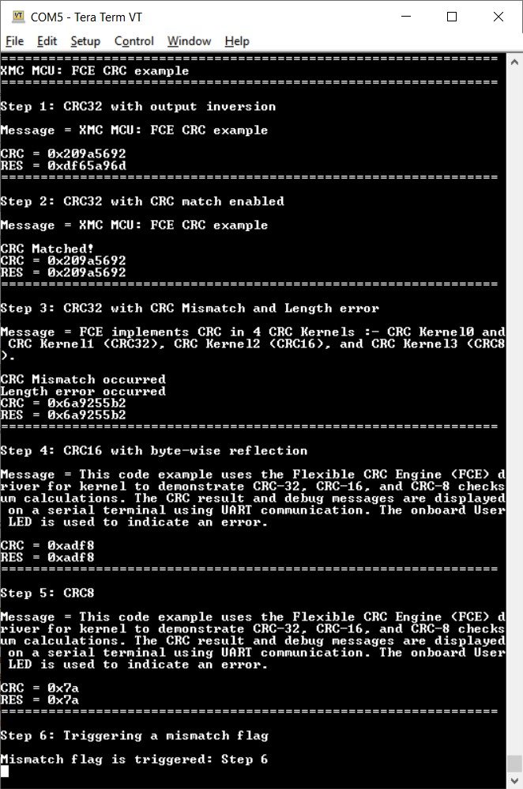
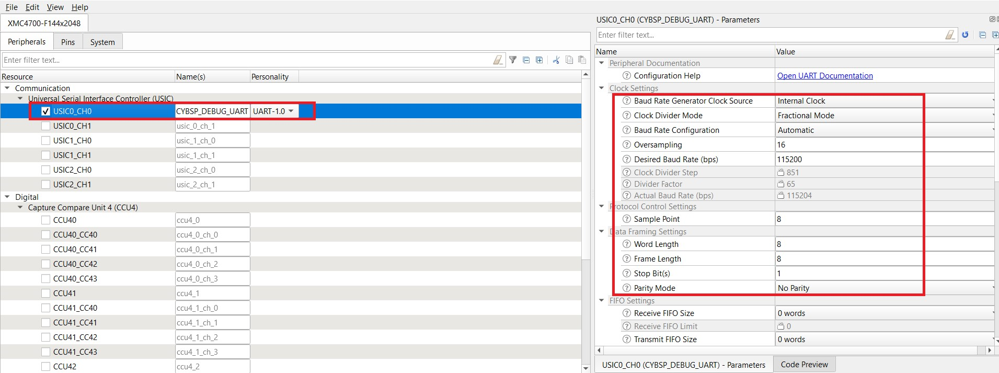
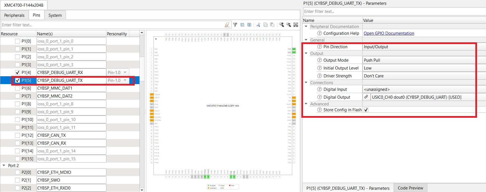
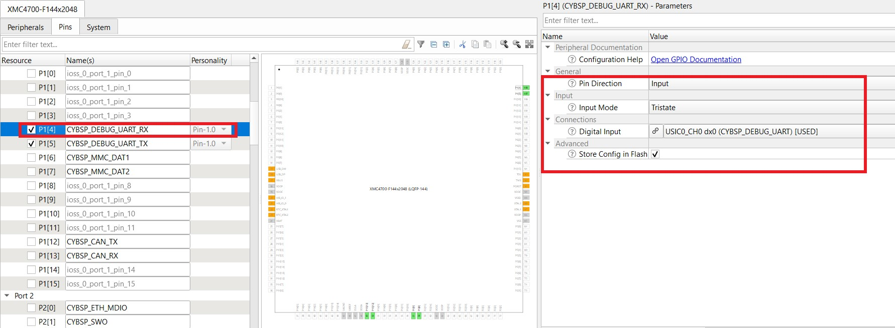

# XMC&trade; MCU: FCE CRC

This code example uses the flexible CRC engine (FCE) driver for kernel to demonstrate CRC-32, CRC-16, and CRC-8 checksum calculations. The CRC result and debug messages are displayed on a serial terminal using UART communication. The onboard User LED is used to indicate an error.

[View this README on GitHub.](https://github.com/Infineon/mtb-example-xmc-fce-crc)

[Provide feedback on this code example.](https://cypress.co1.qualtrics.com/jfe/form/SV_1NTns53sK2yiljn?Q_EED=eyJVbmlxdWUgRG9jIElkIjoiQ0UyMzI2ODAiLCJTcGVjIE51bWJlciI6IjAwMi0zMjY4MCIsIkRvYyBUaXRsZSI6IlhNQyZ0cmFkZTsgTUNVOiBGQ0UgQ1JDIiwicmlkIjoiYnJ2aSIsIkRvYyB2ZXJzaW9uIjoiMi4xLjAiLCJEb2MgTGFuZ3VhZ2UiOiJFbmdsaXNoIiwiRG9jIERpdmlzaW9uIjoiTUNEIiwiRG9jIEJVIjoiSUNXIiwiRG9jIEZhbWlseSI6Ik4vQSJ9)

## Requirements

- [ModusToolbox&trade; software](https://www.infineon.com/modustoolbox) v3.0
- [SEGGER J-Link software](https://www.segger.com/downloads/jlink/#J-LinkSoftwareAndDocumentationPack)
- Programming language: C
- Associated parts: All [XMC4000 MCU](https://www.infineon.com/cms/en/product/microcontroller/32-bit-industrial-microcontroller-based-on-arm-cortex-m/32-bit-xmc4000-industrial-microcontroller-arm-cortex-m4/) parts

## Supported toolchains (make variable 'TOOLCHAIN')

- GNU Arm&reg; embedded compiler v10.3.1 (`GCC_ARM`) - Default value of `TOOLCHAIN`

## Supported kits (make variable 'TARGET')

- [XMC4700 relax kit](https://www.infineon.com/cms/en/product/evaluation-boards/kit_xmc47_relax_v1/) (`KIT_XMC47_RELAX_V1`) - Default value of `TARGET`
- [XMC4200 Platform2Go kit](https://www.infineon.com/cms/en/product/evaluation-boards/kit_xmc_plt2go_xmc4200/) (`KIT_XMC_PLT2GO_XMC4200`)
- [XMC4300 relax EtherCAT kit](https://www.infineon.com/cms/en/product/evaluation-boards/kit_xmc43_relax_ecat_v1/) (`KIT_XMC43_RELAX_ECAT_V1`)
- [XMC4400 Platform2Go kit](https://www.infineon.com/cms/en/product/evaluation-boards/kit_xmc_plt2go_xmc4400/) (`KIT_XMC_PLT2GO_XMC4400`)
- [XMC4500 relax kit](https://www.infineon.com/cms/en/product/evaluation-boards/kit_xmc45_relax_v1/) (`KIT_XMC45_RELAX_V1`)
- [XMC4800 relax EtherCAT kit](https://www.infineon.com/cms/en/product/evaluation-boards/kit_xmc48_relax_ecat_v1/) (`KIT_XMC48_RELAX_ECAT_V1`)

## Hardware setup

This example uses the board's default configuration. See the kit user guide to ensure that the board is configured correctly.

## Software setup

Install a terminal emulator if you don't have one. Instructions in this document use [Tera Term](https://ttssh2.osdn.jp/index.html.en).

This example requires no additional software or tools.

## Using the code example

Create the project and open it using one of the following:

<details><summary><b>In Eclipse IDE for ModusToolbox&trade; software</b></summary>

1. Click the **New Application** link in the **Quick Panel** (or, use **File** > **New** > **ModusToolbox&trade; Application**). This launches the [Project Creator](https://www.infineon.com/ModusToolboxProjectCreator) tool.

2. Pick a kit supported by the code example from the list shown in the **Project Creator - Choose Board Support Package (BSP)** dialog.

   When you select a supported kit, the example is reconfigured automatically to work with the kit. To work with a different supported kit later, use the [Library Manager](https://www.infineon.com/ModusToolboxLibraryManager) to choose the BSP for the supported kit. You can use the Library Manager to select or update the BSP and firmware libraries used in this application. To access the Library Manager, click the link from the **Quick Panel**.

   You can also just start the application creation process again and select a different kit.

   If you want to use the application for a kit not listed here, you may need to update the source files. If the kit does not have the required resources, the application may not work.

3. In the **Project Creator - Select Application** dialog, choose the example by enabling the checkbox.

4. (Optional) Change the suggested **New Application Name**.

5. The **Application(s) Root Path** defaults to the Eclipse workspace which is usually the desired location for the application. If you want to store the application in a different location, you can change the *Application(s) Root Path* value. Applications that share libraries should be in the same root path.

6. Click **Create** to complete the application creation process.

For more details, see the [Eclipse IDE for ModusToolbox&trade; software user guide](https://www.infineon.com/MTBEclipseIDEUserGuide) (locally available at *{ModusToolbox&trade; software install directory}/docs_{version}/mt_ide_user_guide.pdf*).

</details>

<details><summary><b>In command-line interface (CLI)</b></summary>

ModusToolbox&trade; software provides the Project Creator as both a GUI tool and the command line tool, "project-creator-cli". The CLI tool can be used to create applications from a CLI terminal or from within batch files or shell scripts. This tool is available in the *{ModusToolbox&trade; software install directory}/tools_{version}/project-creator/* directory.

Use a CLI terminal to invoke the "project-creator-cli" tool. On Windows, use the command line "modus-shell" program provided in the ModusToolbox&trade; software installation instead of a standard Windows command-line application. This shell provides access to all ModusToolbox&trade; software tools. You can access it by typing `modus-shell` in the search box in the Windows menu. In Linux and macOS, you can use any terminal application.

The "project-creator-cli" tool has the following arguments:

Argument | Description | Required/optional
---------|-------------|-----------
`--board-id` | Defined in the `<id>` field of the [BSP](https://github.com/Infineon?q=bsp-manifest&type=&language=&sort=) manifest | Required
`--app-id`   | Defined in the `<id>` field of the [CE](https://github.com/Infineon?q=ce-manifest&type=&language=&sort=) manifest | Required
`--target-dir`| Specify the directory in which the application is to be created if you prefer not to use the default current working directory | Optional
`--user-app-name`| Specify the name of the application if you prefer to have a name other than the example's default name | Optional

<br>

The following example will clone the "[FCE CRC](https://github.com/Infineon/mtb-example-xmc-fce-crc)" application with the desired name "FceCrc" configured for the *KIT_XMC47_RELAX_V1* BSP into the specified working directory, *C:/mtb_projects*:

   ```
   project-creator-cli --board-id KIT_XMC47_RELAX_V1 --app-id mtb-example-xmc-fce-crc --user-app-name FceCrc --target-dir "C:/mtb_projects"
   ```

**Note:** The project-creator-cli tool uses the `git clone` and `make getlibs` commands to fetch the repository and import the required libraries. For details, see the "Project creator tools" section of the [ModusToolbox&trade; software user guide](https://www.infineon.com/ModusToolboxUserGuide) (locally available at *{ModusToolbox&trade; software install directory}/docs_{version}/mtb_user_guide.pdf*).

</details>

<details><summary><b>In third-party IDEs</b></summary>

**Note:** Only VS code is supported.

1. Follow the instructions from the **In command-line interface (CLI)** section to create the application, and import the libraries using the `make getlibs` command.

2. Export the application to a supported IDE using the `make <ide>` command.

   For a list of supported IDEs and more details, see the "Exporting to IDEs" section of the [ModusToolbox&trade; software user guide](https://www.infineon.com/ModusToolboxUserGuide) (locally available at *{ModusToolbox&trade; software install directory}/docs_{version}/mtb_user_guide.pdf*).

3. Follow the instructions displayed in the terminal to create or import the application as an IDE project.

</details>

## Operation

1. Connect the board to your PC using a micro-USB cable through the debug USB connector.

2. Program the board using Eclipse IDE for ModusToolbox&trade; software:

   1. Select the application project in the Project Explorer.

   2. In the **Quick Panel**, scroll down, and click **\<Application Name> Program (JLink)**.

3. After programming, the application starts automatically. Observe the CRC result and the debug messages on the serial terminal as shown through each step. See the [Design and implementation](#design-and-implementation) section for details of each step.

**Figure 1. Serial terminal log**



A software-triggered mismatch error is generated to validate the transient error detection feature of the FCE. Therefore, at the end of the code example, the User LED turns ON if this error is detected successfully.

## Debugging

You can debug the example to step through the code. In the IDE, use the **\<Application Name> Debug (JLink)** configuration in the **Quick Panel**. For more details, see the "Program and debug" section in the [Eclipse IDE for ModusToolbox&trade; software user guide](https://www.infineon.com/MTBEclipseIDEUserGuide).

## Design and implementation

Flexible CRC engine (FCE) is a hardware acceleration engine for software applications using the CRC algorithm. FCE provides a parallel implementation of CRC algorithms because it consists of four CRC kernels independent of each other. The FCE implements the IEEE 802.3 Ethernet CRC-32 using CRC Kernel 0 and CRC Kernel 1, the CCITT CRC-16 using CRC Kernel 2, and the SAE J1850 CRC-8 using CRC Kernel 3.

This code example is divided into six steps:

- **Step 1:** A CRC-32 operation is performed on a dataset with the seed value set to '0' and output inversion enabled. This step uses CRC Kernel 0.

- **Step 2:** CRC Kernel 1 is used to perform a CRC-32 operation on the same dataset to calculate the CRC value. However, in this case, CRC match is enabled. The CRC result is compared with the CRC result obtained in the previous step (without inversion) to ensure that there in no CRC mismatch.

- **Step 3:** CRC Kernel 1 is used to perform a CRC-32 operation on a different dataset. CRC match is enabled and the same CRC result is used. In this case, CRC mismatch and length error occur because the dataset is different. However, as this error is expected, it is not handled and is just printed onto the serial terminal.

- **Step 4:** CRC Kernel 2 is used to perform a CRC-16 operation with the seed value of '0' and byte-wise reflection enabled.

- **Step 5:** CRC Kernel 3 is used to demonstrate CRC-8.

- **Step 6:** The FCE provides a feature to validate the CRC compare logic by forcing a register mismatch. Here, the mismatch is software-triggered. The occurrence of the error in this step ensures the functionality of the compare logic.


### Resources and settings

The project uses a custom *design.modus* file because the following settings were modified in the default *design.modus* file.

**Figure 2. USIC (UART) settings**



<br>

**Figure 3. UART Tx pin settings**



<br>

**Figure 4. UART Rx pin settings**




## Related resources

Resources  | Links
-----------|----------------------------------
Code examples  | [Using ModusToolbox&trade; software](https://github.com/Infineon/Code-Examples-for-ModusToolbox-Software) on GitHub
Device documentation | [XMC4000 MCU family datasheets](https://www.infineon.com/cms/en/product/microcontroller/32-bit-industrial-microcontroller-based-on-arm-cortex-m/32-bit-xmc4000-industrial-microcontroller-arm-cortex-m4/#document-group-myInfineon-49) <br> [XMC4000 MCU family technical reference manuals](https://www.infineon.com/cms/en/product/microcontroller/32-bit-industrial-microcontroller-based-on-arm-cortex-m/32-bit-xmc4000-industrial-microcontroller-arm-cortex-m4/#document-group-myInfineon-44)
Development kits | [XMC&trade; MCU eval boards](https://www.infineon.com/cms/en/product/microcontroller/32-bit-industrial-microcontroller-based-on-arm-cortex-m/#boards)
Libraries on GitHub  | [mtb-xmclib-cat3](https://github.com/Infineon/mtb-xmclib-cat3) – XMC&trade; peripheral driver library (XMCLib)
Tools  | [Eclipse IDE for ModusToolbox&trade; software](https://www.infineon.com/modustoolbox) – ModusToolbox&trade; software is a collection of easy-to-use software and tools enabling rapid development with Infineon MCUs, covering applications from embedded sense and control to wireless and cloud-connected systems using AIROC&trade; Wi-Fi and Bluetooth® connectivity devices.

## Other resources

Infineon provides a wealth of data at [www.infineon.com](https://www.infineon.com/) to help you select the right device, and quickly and effectively integrate it into your design.

For XMC&trade; MCU devices, see [32-bit XMC&trade; Industrial microcontroller based on Arm® Cortex®-M](https://www.infineon.com/cms/en/product/microcontroller/32-bit-industrial-microcontroller-based-on-arm-cortex-m/).

## Document history

Document title: *CE232680* - *XMC&trade; MCU: FCE CRC*

| Version | Description of change |
| ------- | --------------------- |
| 1.0.0   | New code example      |
| 1.1.0   | Added support for new kits |
| 2.0.0   | Updated to support ModusToolbox&trade; software v3.00. This CE is not backward compatible with previous versions of ModusToolbox&trade; software.|
| 2.1.0   | Added support for FCE personality |
------

All other trademarks or registered trademarks referenced herein are the property of their respective owners.

© 2022 Infineon Technologies AG

All Rights Reserved.

### Legal disclaimer

The information given in this document shall in no event be regarded as a guarantee of conditions or characteristics. With respect to any examples or hints given herein, any typical values stated herein and/or any information regarding the application of the device, Infineon Technologies hereby disclaims any and all warranties and liabilities of any kind, including without limitation, warranties of non-infringement of intellectual property rights of any third party.

### Information

For further information on technology, delivery terms and conditions and prices, please contact the nearest Infineon Technologies Office (www.infineon.com).

### Warnings

Due to technical requirements, components may contain dangerous substances. For information on the types in question, please contact the nearest Infineon Technologies Office.

Infineon Technologies components may be used in life-support devices or systems only with the express written approval of Infineon Technologies, if a failure of such components can reasonably be expected to cause the failure of that life-support device or system or to affect the safety or effectiveness of that device or system. Life support devices or systems are intended to be implanted in the human body or to support and/or maintain and sustain and/or protect human life. If they fail, it is reasonable to assume that the health of the user or other persons may be endangered.

-------------------------------------------------------------------------------
